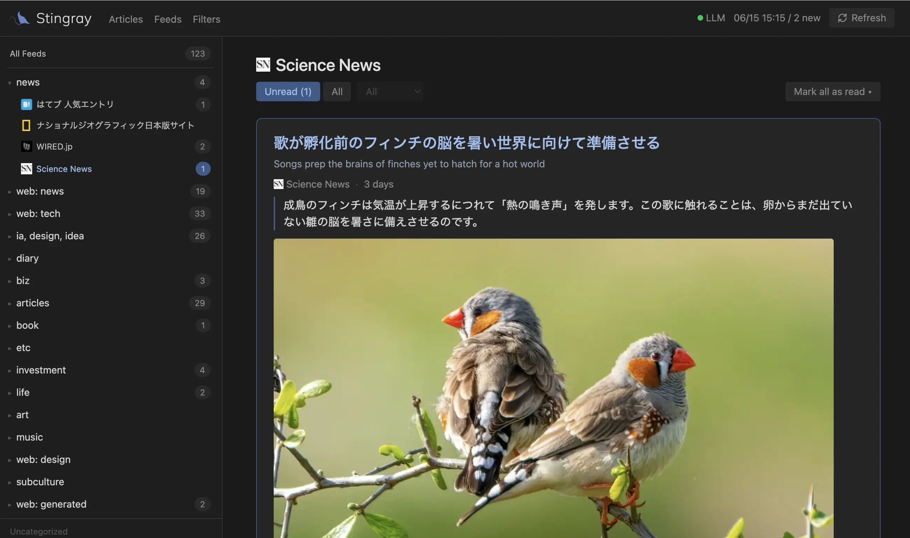

<div align="center">

# Stingray

**RSS/Atom フィードを一つのタイムラインに集約する、セルフホスト型の Web リーダーです。<br>ローカル LLM が翻訳と要約を自動で付けます。**

[](https://github.com/ryochin/stingray/actions/workflows/ci.yml)
[](LICENSE)

[英語](README.md) | **日本語**



</div>

---

購読しているフィードの新着を一本のタイムラインにまとめ、購読履歴を外部サービスに預けることなく、すべてを手元のサーバに置いておけます。外国語の記事には、ローカル LLM（[Ollama](https://ollama.com/)）が設定した母語への翻訳と要約を自動で付与します。

> [!NOTE]
> **このプロジェクトのコードは、すべて AI によって書かれています。**
> 改善点があれば PR を歓迎しますが、それ以上に期待しているのは、各自がこれを **AI で自由に拡張するためのベース** として使ってもらうことです。欲しい機能を本家に取り込んでもらうのを待つのではなく、自分の AI に頼んで、自分の手元で好きなように作り変える ── そんな出発点になれば、と考えています。

## 目次

- [主な機能](#主な機能)
- [必要環境](#必要環境)
- [クイックスタート](#クイックスタート)
- [環境変数（`.env`）](#環境変数env)
- [LLM（Ollama）](#llmollama)
- [アプリ設定（`config.yml`）](#アプリ設定configyml)
- [バックアップとリストア](#バックアップとリストア)
- [トラブルシューティング](#トラブルシューティング)
- [ライセンス](#ライセンス)

## 主な機能

### 📚 フィードをまとめて読む

**RSS / Atom**（RDF や JSON Feed も含む）を購読できます。登録はフィードの URL を直接指定するほか、**サイトのトップページ URL を貼れば、ページ内のフィードリンクを自動検出**して取り込めます。フィード名と言語も、取得したフィード情報や URL などから自動で判別されます。購読中のフィードは **フォルダ** でまとめて整理でき、フォルダの順序も、同じフォルダ内のフィードの順序も、ドラッグ＆ドロップで並び替えられます。サイドバーからはフォルダ単位・フィード単位で記事を絞り込めます。新しく追加したフィードは一覧の **一番上** に表示され、カードはそのまま展開状態になるので、続けて名前やルールをすぐ編集できます。調子の悪いフィードにはその場で印が付き、キャッシュから配信している場合や抽出ルールが未設定の場合は **Stale**、取得に失敗した場合は **Error** が、直近のエラー内容とともに表示されます。フィード単位の手動フェッチや、購読を解除せずに一時停止することもできます。

### 🔎 フィードのないページもフィードにする

RSS を提供していない Web ページでも、Stingray なら購読対象にできます。フィードに **CSS セレクタの抽出ルール** を与えると、ページ内のどこを記事の単位（`item`）とみなし、どこからタイトル・リンク・日付・サムネイルを取るかを指定でき、通常のフィードと同じように新着を一覧へ流し込めます。抽出ルールはフィードごとに JSON で設定します。

たとえば、各記事が `<li class="entry">` で並び、その中にタイトルリンクと日付を持つページなら、次のようなルールになります。

```json
{
  "item": "li.entry",
  "title": "a.headline",
  "link": "a.headline",
  "date": "time.published",
  "date_attr": "datetime",
  "thumbnail": "img.thumb"
}
```

- `item`（必須）— 記事 1 件に対応する要素のセレクタ。ページ全体に対して評価されます。
- `title`（必須）— アイテム内のタイトル要素。そのテキストを記事タイトルにします。
- `link`（必須）/ `link_attr` — リンク要素のセレクタと、URL を読む属性（既定 `href`）。アイテム自身が `<a>` の場合は `"_self"` を指定します。
- `date` / `date_attr` — 日付要素と、属性から読む場合の属性名（省略時は要素のテキスト）。ISO 8601 のほか、`2026-04-10` / `April 10, 2026` / `2026年4月10日` などを解釈します。
- `thumbnail` / `thumbnail_attr` — サムネイル画像の要素と属性（既定 `src`）。

必須は `item` / `title` / `link` の 3 つで、`date` 系・`thumbnail` 系は任意です。`item` 以外のセレクタは各アイテム内で評価され、相対 URL は自動的に絶対 URL へ補完されます。ルールは Web UI の `/feeds` でフィードごとに設定し、保存後の手動更新または次回巡回時から適用されます。不正な CSS セレクタ・未知のキー・長すぎる値は、取得時ではなく保存時に拒否されます。

セレクタは必ずしも手で書く必要はありません。ルールエディタの **✨ Infer with LLM** を押すと、前処理したページの HTML を Ollama に渡してルール案を生成させ、実際にスクレイパを走らせて検証します。結果は、そのルールで実際に抽出できた記事とともに編集可能な **プレビュー** として提示されるので、抽出できなかった場合でも手直しの出発点として使えます。保存するまでは反映されません。推論の粘り強さは `config.yml` の `selector_inference:` で調整します。

### 🧹 ノイズを減らすフィルタ

読みたくない記事を自動でふるい落とすルールフィルタを備えています。パターンの照合対象は **タイトルのみ**（Title）か **タイトルと本文の両方**（Both）から選べ、マッチした記事を一覧から除外します。タイトルは原文と翻訳後の両方が照合対象になります。パターンは単純なキーワード（部分一致・大文字小文字を区別しない）のほか、`/.../` で囲めば正規表現としても書けます。ルールはフィルタ画面で編集でき、JSON での import / export にも対応します。

### 🤖 LLM による翻訳と要約

ローカルの Ollama を使い、外国語の記事には **タイトルの翻訳** を付け、本文は短ければ全文を翻訳し、長ければネイティブ言語（`native_lang`）の **要約** に置き換えます。翻訳（translate）と要約（summarize）はフィード単位の独立したスイッチで、Web UI（`/feeds`）で個別に切り替えられます。実際の生成内容は、この 2 つと本文の長さの組み合わせで決まります（全文がそのまま翻訳されるのは短い記事だけです）。

| 翻訳 | 要約 | 短い記事（300 字未満） | 長い記事（300 字以上） |
|:---:|:---:|---|---|
| ON | ON | タイトル＋本文を全文翻訳 | タイトルを翻訳し、本文はネイティブ言語の要約に置換 |
| ON | OFF | タイトル＋本文を全文翻訳 | **タイトルのみ翻訳**（本文は原語のまま・要約なし） |
| OFF | ON | LLM なし | ネイティブ言語の要約（タイトルは原語のまま） |
| OFF | OFF | LLM なし | LLM なし |

登録時に RSS/Atom フィードの言語を判定し、ネイティブ言語（`native_lang`）と異なると判定されたフィードは **翻訳・要約をともに自動で有効** にします（外国語フィードは追加するだけで、タイトルが翻訳され、本文も短ければ全文翻訳・長ければ要約が付きます）。母語と判定されたフィードはどちらも無効のままなので、要約が欲しい場合は `/feeds` で要約を ON にしてください。

言語を判定できなかったフィードの扱いは、ネイティブ言語自体を判定できるかどうかで決まります。日本語のように固有の文字体系や TLD を持つ言語がネイティブなら、「判定されなかった＝母語ではない」とみなして翻訳を有効にします。一方、英語のように判定手段を持たない言語がネイティブの場合は、無効のままにします（そうしないと `<language>` タグのないフィードがすべて英語から英語へ翻訳され続けてしまうため）。いずれも `/feeds` でフィードごとに切り替えられます。

これらはフェッチの段階でまとめて生成され、記事に保存されるため、記事を開いたときにはあらかじめ用意されています。

### 📖 読む・追いつく

- **既読 / 未読管理** — 記事の既読・未読をトグルでき、「○時間より古いものだけ」といった条件付きでフォルダ・フィードをまとめて一括既読にできます。全件をまとめて未読へ戻すこともできます。`u` で「未読のみ」と「すべて」を切り替えられ、未読件数はサイドバーとブラウザのタブタイトルに表示されます。
- **表示する時間範囲** — 記事一覧は既定で直近 **3 日** 分を表示し、24 時間 / 1 週間 / 2 週間 / 30 日 / 全期間に切り替えられます。この範囲は「すべて」を表示しているときに効き、「未読のみ」表示中は無効になります。
- **キーボード操作** — `j` / `k` で記事を送り、`m` で既読・未読を切り替え、フィードの末尾で「読み終えました」の案内が出ている間に `Space` を押すと次の未読フィードへジャンプします。ショートカット一覧は `?` で表示します。
- **OPML import / export** — 他のリーダーからの移行や、購読リストのバックアップに。フォルダ構成や翻訳・要約の設定、抽出ルールまで含めて入出力します。
- **リッチな表示** — 記事中のサムネイルや画像を取り込んで一覧に表示し、Twitter / X の埋め込みは読みやすいカードに整形します。

### ⏱️ 自動で集めてくる

フィードの取得はバックグラウンドで自動的に行われます。取得間隔はフィードごとに **自動で調整** され、新着が続くフィードは短い間隔で、更新の乏しいフィードは次第に長い間隔（おおむね 10 分〜6 時間）で巡回します。スケジューラ（cron）は 15 分おきに起動し、その時点で取得期限の来たフィードだけを取りに行きます。もちろん画面からの手動更新も可能です。

取り込み時には、記事リンクから `utm_*` や `fbclid` などの**トラッキングパラメータを自動で除去**し、クリーンな URL として保存します。

## 必要環境

- **Docker / Docker Compose**（v2 以降）— PostgreSQL 17 を含むすべてのサービスがコンテナ内で完結するため、DB を別途インストールする必要はありません。
- **Ollama** — ホスト側で起動します（推奨モデル `gemma4:e4b`）。翻訳・要約、および **Infer with LLM** に使います。LLM をまったく使わない場合は `config.yml` で `ollama.enabled: false` を設定してください。

## クイックスタート

```bash
git clone https://github.com/ryochin/stingray.git
cd stingray

cp .env.example .env                # 環境設定をコピー（必要に応じて編集）
cp config.yml.example config.yml    # アプリ設定をコピー（必要に応じて編集）
docker compose up -d                # 起動
```

- **Web UI**: http://localhost:20080
- **稼働確認**: http://localhost:20080/api/health

> [!IMPORTANT]
> Stingray には認証機構がありません。`WEB_PORT` に到達できる相手は誰でも記事の閲覧・購読操作が可能です。万が一 LAN 外やインターネットに公開する場合は、リバースプロキシでの Basic 認証や VPN などで前段を保護するか、公開ポートをループバックに限定してください。
>
> ```yaml
> # compose.yml の web サービス
> ports:
>   - "127.0.0.1:${WEB_PORT:-20080}:20080"
> ```

初回起動後、Web UI の `/feeds` から RSS URL を直接追加するか、OPML インポートで一括追加します。フィード名と言語は、取得したフィード情報や URL などから自動検出されます。

```bash
docker compose down            # 停止
docker compose logs -f         # ログ確認
docker compose up -d --build   # 再ビルド
```

## 環境変数（`.env`）

`.env.example` を `.env` にコピーして使用します。主な変数は次のとおりです。

| 変数 | デフォルト | 用途 |
|---|---|---|
| `TZ` | `UTC` | コンテナのタイムゾーン（ログ表示にのみ影響） |
| `OLLAMA_BASE_URL` | `http://host.docker.internal:11434` | Ollama サーバ URL |
| `POSTGRES_USER` / `POSTGRES_PASSWORD` / `POSTGRES_DB` | `stingray` | DB 認証情報 |
| `DATABASE_URL` | `POSTGRES_*` から構築 | 完全な DSN（注） |
| `WEB_PORT` | `20080` | Web のホスト公開ポート |

> 注: `.env.example` は `DATABASE_URL` の明示値を同梱しています。DB 認証情報を変える場合は `POSTGRES_*` と `DATABASE_URL` を必ず揃えてください（`DATABASE_URL` を未設定にすれば、compose が `POSTGRES_*` から組み立てます）。

## LLM（Ollama）

Ollama.app を起動するか、CLI で `ollama serve` を実行してサーバを立ち上げ、別ターミナルでモデルを取得します（`ollama serve` はフォアグラウンドで起動し続けます）。

```bash
ollama pull gemma4:e4b
```

macOS の Docker Desktop では `host.docker.internal` 経由で自動的に接続されます。Linux や別ホストで動かす場合は、`.env` の `OLLAMA_BASE_URL` をホストの LAN IP などに書き換えてください。Ollama は既定でループバックのみを待ち受けるため、コンテナや LAN からの接続を許可するには待ち受けアドレスの公開設定が必要です。これは Ollama API を LAN に開放する設定なので、信頼できるネットワーク内に限定し、インターネットへ直接公開しないでください。

macOS の場合:

```bash
launchctl setenv OLLAMA_HOST 0.0.0.0:11434
```

Linux（systemd）の場合は `sudo systemctl edit ollama` で次を追記し、`sudo systemctl restart ollama` で再起動します。

```ini
[Service]
Environment="OLLAMA_HOST=0.0.0.0:11434"
```

## アプリ設定（`config.yml`）

`config.yml.example` を `config.yml` にコピーして使用します（`config.yml` 自体はリポジトリに含まれません）。主な項目は次のとおりです。

```yaml
native_lang: "en"                 # ネイティブ言語（他言語フィードは翻訳対象になる）
max_age_hours: 48                 # 取得する記事の時間幅
max_items_per_feed: 200           # 1 回の更新で取り込む最大記事数（フィード単位）
cache_dir: "cache"                # フィード本文のキャッシュ
article_cache_max_age_days: 0     # 記事キャッシュ保持日数（0 = 無制限）
article_order: "oldest"           # 記事一覧の並び順（"oldest" = 古い順 / "newest" = 新しい順）
# user_agent: "Mozilla/5.0 ..."   # 取得時の UA（既定はブラウザ UA。必要なら上書き）

ollama:
  enabled: true            # 翻訳・要約の有効/無効（false で LLM を使わない）
  model: "gemma4:e4b"
  timeout: 120             # LLM 1 リクエストあたりの秒数

selector_inference:        # 「Infer with LLM」ボタンの挙動
  max_html_bytes: 150000   # LLM に渡す前処理済み HTML の最大バイト数
  max_attempts: 4          # 記事一覧を特定するまでの試行回数（初回を含む）
  num_ctx: 65536           # 推論時の Ollama コンテキスト長（モデルが対応している必要あり）
  min_articles: 3          # ルールを採用するのに必要な最小抽出件数

url_cleanup:
  enabled: true            # 取り込み時に既知のトラッキングパラメータ（utm_* など）を除去
```

設定は、その性質に応じて 2 種類のファイルに分けています。ホストごとに変わる**接続情報や秘密**（DB 認証・`OLLAMA_BASE_URL`・公開ポート等）は `.env` に、環境に依らない**アプリの挙動**（モデル名・タイムアウト・取得期間・ネイティブ言語等）は `config.yml` に置きます。たとえば Ollama サーバの URL は接続情報なので、`config.yml` ではなく `.env` の `OLLAMA_BASE_URL` で指定します。同じ値を両方に書くことはありません。

フィード定義は DB が正本です（Web UI から追加・編集します）。

> [!NOTE]
> `config.yml` の変更は、Web コンテナを再起動（`docker compose restart web`）すると反映されます。

## バックアップとリストア

購読フィード・記事・既読状態・フォルダ・フィルタなど、利用データはすべて PostgreSQL（`./data/postgres`）に保存されます。`./cache` は再生成可能なキャッシュなのでバックアップ不要です。なお、同じ環境を丸ごと復元したい場合は、利用データ（DB）に加えて `.env` と `config.yml` も別途保管してください。

退避は、コンテナ起動中に `pg_dump` の出力を bzip2 で固めます（ホスト側に `bzip2` が必要です）。

```bash
docker compose exec -T postgres pg_dump -U stingray stingray | bzip2 > backup.sql.bz2
```

リストアは**空の DB** へ流し込みます。Web / Fetcher が起動するとスキーマが自動作成されダンプと衝突するため、**PostgreSQL だけを起動した状態**で実行してください。

```bash
docker compose down                    # 全サービス停止
rm -rf data/postgres                   # 既存データを破棄（まっさらに戻す）
docker compose up -d postgres          # DB だけ起動
bunzip2 -c backup.sql.bz2 | docker compose exec -T postgres psql -U stingray -v ON_ERROR_STOP=1 stingray
docker compose up -d                   # 残りのサービスを起動
```

`.env` で DB 認証情報を変えている場合は、`POSTGRES_USER` / `POSTGRES_PASSWORD` / `POSTGRES_DB` と `DATABASE_URL` の 4 項目を矛盾なく揃えたうえで、上記コマンドの `-U`・データベース名もその値に合わせてください。

## トラブルシューティング

**翻訳・要約が付かない**

Ollama に接続できていない可能性があります。`docker compose logs -f web` で接続エラーの有無を確認したうえで、ホスト側で `ollama serve` が起動しているか、`OLLAMA_BASE_URL` がコンテナから到達できるアドレスか、モデルを `ollama pull gemma4:e4b` で取得済みかを確認してください。そもそも LLM を使わない場合は `config.yml` で `ollama.enabled: false` を設定します。

**新着が増えない**

スケジューラは取得期限の来たフィードだけを巡回します（「自動で集めてくる」を参照）。すぐ確認したいときは Web UI から手動更新してください。また、定期巡回と一括更新では `config.yml` の `max_age_hours` より古い記事は取り込まれません（フィード単位の手動更新にはこの制限は適用されません）。

**`config.yml` の変更が反映されない**

Web コンテナの再起動が必要です（`docker compose restart web`）。

## ライセンス

MIT — [`LICENSE`](LICENSE) を参照。
