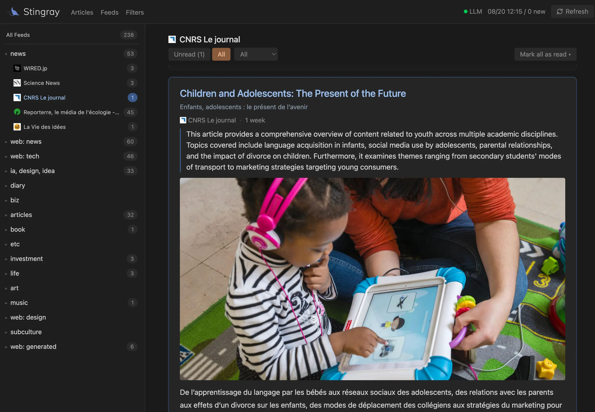

<div align="center">

# Stingray

**A self-hosted web reader that pulls your RSS/Atom feeds into a single timeline,<br>with translation and summarization from a local LLM.**

[](https://github.com/ryochin/stingray/actions/workflows/ci-backend.yml)
[](https://github.com/ryochin/stingray/actions/workflows/ci-frontend.yml)
[](LICENSE)

**English** | [Japanese](README.ja.md)



</div>

---

Stingray collects everything new from the feeds you subscribe to into one timeline and keeps all of it on your own server, so your reading history never sits with a third-party service. Articles in another language get a translation and a summary from a local LLM ([Ollama](https://ollama.com/)) in whichever language you set as your own.

> [!NOTE]
> **Every line of code in this project was written by AI.**
> Pull requests are welcome, but what I hope for more is that you treat this as **a base to extend with AI however you like**. Rather than waiting for a feature to land upstream, ask your own AI and reshape it on your own machine — I would like this to be a starting point for exactly that.

## Contents

- [Features](#features)
- [Requirements](#requirements)
- [Quick start](#quick-start)
- [Environment variables (`.env`)](#environment-variables-env)
- [LLM (Ollama)](#llm-ollama)
- [Application settings (`config.yml`)](#application-settings-configyml)
- [Backup and restore](#backup-and-restore)
- [Troubleshooting](#troubleshooting)
- [License](#license)

## Features

### 📚 Read every feed in one place

Subscribe to **RSS / Atom** feeds, including RDF and JSON Feed. Add a feed by its URL directly, or **paste a site's homepage URL and Stingray finds the feed links on the page** for you. Feed names and languages are detected automatically from the feed metadata and the URL. Organize subscriptions into **folders**, reorder both the folders and the feeds inside them by drag and drop, and narrow the article list by folder or by feed from the sidebar. A newly added feed appears at the **top** of the list with its card already expanded, so you can edit its name and rules right away. A feed that stops behaving is flagged in place — **Stale** when it is being served from cache or has no extraction rules yet, **Error** when it failed outright — along with its latest error message, and any feed can be fetched on demand or switched off without unsubscribing.

### 🔎 Turn any page into a feed

A web page that offers no RSS can still become a subscription. Give a feed a set of **CSS selector extraction rules** to say which element on the page is one article (`item`) and where to read its title, link, date, and thumbnail from, and new entries flow into the same list as any ordinary feed. Extraction rules are configured per feed as JSON.

For example, a page whose articles are `<li class="entry">` elements containing a title link and a date needs rules like this:

```json
{
  "item": "li.entry",
  "title": "a.headline",
  "link": "a.headline",
  "date": "time.published",
  "date_attr": "datetime",
  "thumbnail": "img.thumb"
}
```

- `item` (required) — selector for the element that represents a single article. Evaluated against the whole page.
- `title` (required) — the title element inside an item. Its text becomes the article title.
- `link` (required) / `link_attr` — selector for the link element and the attribute to read the URL from (`href` by default). Use `"_self"` when the item itself is an `<a>`.
- `date` / `date_attr` — the date element and, when reading from an attribute, its name (falls back to the element's text). ISO 8601 is understood, as are common written forms such as `2026-04-10`, `April 10, 2026`, and `10 Apr 2026`.
- `thumbnail` / `thumbnail_attr` — the thumbnail image element and attribute (`src` by default).

Only `item`, `title`, and `link` are required; the `date` and `thumbnail` families are optional. Every selector other than `item` is evaluated inside each item, and relative URLs are resolved to absolute ones automatically. Rules are set per feed under `/feeds` in the web UI and take effect on the next manual refresh or scheduled crawl after saving. An invalid CSS selector, an unknown key, or an over-long value is rejected when you save the rules, not at fetch time.

Writing the selectors by hand is optional. Press **✨ Infer with LLM** in the rules editor and Stingray hands the page's preprocessed HTML to Ollama, has it propose a rule set, then checks that guess by actually running the scraper against the page. Whatever it settles on comes back as an editable **preview**, next to the articles those rules actually matched, so even a guess that came up empty is a starting point to correct by hand — nothing is saved until you say so. How hard it tries is tuned under `selector_inference:` in `config.yml`.

### 🧹 Filter out the noise

Rule-based filters drop articles you would rather not see. Set a pattern and choose whether it is matched against the article's **title** only or against **both** title and body; matching articles are excluded from the list. Titles are matched in their original and translated forms alike. A pattern is a plain keyword by default — substring match, case-insensitive — or a regular expression when wrapped in `/.../`. Rules are edited on the filter screen and can be imported and exported as JSON.

### 🤖 Translation and summarization with an LLM

Using a local Ollama instance, articles in another language get a **translated title**, and the body is either translated in full when it is short or replaced with a **summary** in your language (`native_lang`) when it is long. Translation and summarization are independent per-feed switches, toggled individually in the web UI under `/feeds`. What actually gets generated depends on those two switches and the length of the body — only short articles are translated in full.

| Translate | Summarize | Short article (< 300 chars) | Long article (>= 300 chars) |
|:---:|:---:|---|---|
| ON | ON | Title and body translated in full | Title translated, body replaced with a summary in your language |
| ON | OFF | Title and body translated in full | **Title only** (body left in the original language, no summary) |
| OFF | ON | No LLM | Summary in your language (title left in the original language) |
| OFF | OFF | No LLM | No LLM |

When a feed is added, Stingray detects the language of the RSS/Atom feed, and a feed detected as something other than your native language (`native_lang`) gets **both translation and summarization enabled automatically**. Adding a foreign-language feed is all it takes: titles are translated, and bodies are either translated in full when short or summarized when long. A feed detected as your own language keeps both switches off, so turn summarization on under `/feeds` if you want summaries there.

What happens to a feed whose language could not be determined depends on whether your native language is itself detectable. If it is — Japanese, for instance, has a script and a TLD of its own — then "not detected" is read as "not my language" and translation is enabled. If it is not, as with English, both switches are left off; otherwise every feed without a `<language>` tag would be translated from English into English forever. Either way you can flip the switches per feed under `/feeds`.

All of this is generated during the fetch and stored with the article, so it is already there by the time you open it.

### 📖 Read and catch up

- **Read / unread tracking** — toggle an article between read and unread, and mark a whole folder or feed as read at once, optionally scoped to "only items older than N hours". Everything can be marked unread again in one go. `u` switches between unread-only and all articles, and unread counts appear in the sidebar and in the browser tab title.
- **Time range** — the article list covers the last **3 days** by default, switchable to 24 hours, 1 week, 2 weeks, 30 days, or the whole history. The range applies while you are looking at all articles; unread-only mode ignores it.
- **Keyboard-driven reading** — move through articles with `j` / `k`, toggle read state with `m`, and, while the "caught up" hint at the end of a feed is showing, jump to the next unread feed with `Space`. Press `?` for the full list of shortcuts.
- **OPML import / export** — for migrating from another reader or backing up your subscription list. Folder structure, translation and summarization settings, and extraction rules all travel with it.
- **Rich rendering** — thumbnails and images from articles are pulled into the list, and Twitter / X embeds are reformatted as readable cards.

### ⏱️ Fetch on its own

Feeds are fetched automatically in the background. The interval is **tuned automatically per feed**: one that keeps publishing is crawled often, while a quiet one backs off gradually, roughly between 10 minutes and 6 hours. The scheduler (cron) wakes every 10 minutes and fetches only the feeds that are due at that moment. Manual refresh from the UI is available too, of course.

At ingest time, **tracking parameters such as `utm_*` and `fbclid` are stripped** from article links so that clean URLs are what get stored.

## Requirements

- **Docker / Docker Compose** (v2 or later) — every service including PostgreSQL 17 runs inside containers, so there is no database to install separately.
- **Ollama** — runs on the host (`gemma4:e4b` recommended). Needed for translation, summarization, and the **Infer with LLM** button. To skip the LLM entirely, set `ollama.enabled: false` in `config.yml`.

## Quick start

```bash
git clone https://github.com/ryochin/stingray.git
cd stingray

cp .env.example .env                # Copy the environment settings (edit as needed)
cp config.yml.example config.yml    # Copy the application settings (edit as needed)
docker compose up -d                # Start
```

- **Web UI**: http://localhost:20080
- **Health check**: http://localhost:20080/api/health

> [!IMPORTANT]
> Stingray has no authentication. Anyone who can reach `WEB_PORT` can read articles and change subscriptions. If you ever expose it beyond your LAN or to the internet, put something in front of it — Basic auth on a reverse proxy, or a VPN — or bind the published port to loopback only.
>
> ```yaml
> # the web service in compose.yml
> ports:
>   - "127.0.0.1:${WEB_PORT:-20080}:20080"
> ```

After the first start, add feeds under `/feeds` in the web UI, either by RSS URL or in bulk via OPML import. Feed names and languages are detected automatically from the feed metadata and the URL.

```bash
docker compose down            # Stop
docker compose logs -f         # Follow logs
docker compose up -d --build   # Rebuild
```

## Environment variables (`.env`)

Copy `.env.example` to `.env` and edit it. The main variables are:

| Variable | Default | Purpose |
|---|---|---|
| `TZ` | `UTC` | Container timezone (affects log timestamps only) |
| `OLLAMA_BASE_URL` | `http://host.docker.internal:11434` | Ollama server URL |
| `POSTGRES_USER` / `POSTGRES_PASSWORD` / `POSTGRES_DB` | `stingray` | Database credentials |
| `DATABASE_URL` | built from `POSTGRES_*` | Full DSN (see note) |
| `WEB_PORT` | `20080` | Host port the web service is published on |

> Note: `.env.example` ships an explicit `DATABASE_URL`. If you change the database credentials, keep `POSTGRES_*` and `DATABASE_URL` consistent with each other — or leave `DATABASE_URL` unset and let compose assemble it from `POSTGRES_*`.

## LLM (Ollama)

Start the server by launching Ollama.app or running `ollama serve` from the CLI, then pull the model from another terminal (`ollama serve` stays in the foreground).

```bash
ollama pull gemma4:e4b
```

On Docker Desktop for macOS the connection goes through `host.docker.internal` automatically. On Linux, or when Ollama runs on a different host, point `OLLAMA_BASE_URL` in `.env` at that host's LAN IP. Ollama listens on loopback only by default, so accepting connections from containers or the LAN means changing the address it binds to. That opens the Ollama API to your LAN, so keep it to a network you trust and never expose it directly to the internet.

On macOS:

```bash
launchctl setenv OLLAMA_HOST 0.0.0.0:11434
```

On Linux with systemd, run `sudo systemctl edit ollama`, add the following, and restart with `sudo systemctl restart ollama`.

```ini
[Service]
Environment="OLLAMA_HOST=0.0.0.0:11434"
```

## Application settings (`config.yml`)

Copy `config.yml.example` to `config.yml` and edit it — `config.yml` itself is not part of the repository. The main keys are:

```yaml
native_lang: "en"                 # Your language (feeds in other languages get translated)
max_age_hours: 48                 # How far back to include articles
max_items_per_feed: 200           # Max articles to ingest per feed on each refresh
cache_dir: "cache"                # Cache for feed bodies
article_cache_max_age_days: 0     # Days to keep the article cache (0 = keep forever)
article_order: "oldest"           # Article list order ("oldest" or "newest" first)
# user_agent: "Mozilla/5.0 ..."   # UA used when fetching (defaults to a browser UA; override if needed)

ollama:
  enabled: true            # Translation and summarization on/off (false disables all LLM calls)
  model: "gemma4:e4b"
  timeout: 120             # Seconds per LLM request

selector_inference:        # The "Infer with LLM" button
  max_html_bytes: 150000   # Max preprocessed HTML sent to the LLM
  max_attempts: 4          # Attempts allowed to locate the article list (the first one included)
  num_ctx: 65536           # Ollama context window (the model must support it)
  min_articles: 3          # Min articles a rule set must extract to be accepted

url_cleanup:
  enabled: true            # Strip known tracking params (utm_*, ...) at ingest time
```

Settings are split across two files by their nature. Anything that varies per host — **connection details and secrets** such as database credentials, `OLLAMA_BASE_URL`, and the published port — lives in `.env`, while **application behavior** that does not depend on the environment — model name, timeouts, fetch window, your language — lives in `config.yml`. The Ollama server URL, for example, is a connection detail, so it goes in `OLLAMA_BASE_URL` in `.env` rather than in `config.yml`. No value is ever written in both.

Feed definitions live in the database, which is the source of truth for them; add and edit those from the web UI.

> [!NOTE]
> Changes to `config.yml` take effect once the web container is restarted (`docker compose restart web`).

## Backup and restore

Everything you accumulate — subscriptions, articles, read state, folders, filters — is stored in PostgreSQL under `./data/postgres`. `./cache` is regenerable and needs no backup. To be able to restore an environment as a whole, keep `.env` and `config.yml` alongside the database dump.

Take a dump while the containers are running and compress it with bzip2 (`bzip2` needs to be available on the host).

```bash
docker compose exec -T postgres pg_dump -U stingray stingray | bzip2 > backup.sql.bz2
```

Restore into an **empty database**. The web and fetcher services create the schema on startup and would collide with the dump, so run this with **only PostgreSQL up**.

```bash
docker compose down                    # Stop every service
rm -rf data/postgres                   # Discard existing data (back to a clean slate)
docker compose up -d postgres          # Start the database only
bunzip2 -c backup.sql.bz2 | docker compose exec -T postgres psql -U stingray -v ON_ERROR_STOP=1 stingray
docker compose up -d                   # Start the remaining services
```

If you changed the database credentials in `.env`, make sure `POSTGRES_USER`, `POSTGRES_PASSWORD`, `POSTGRES_DB`, and `DATABASE_URL` all agree, and match `-U` and the database name in the commands above to those values.

## Troubleshooting

**No translations or summaries appear**

Stingray probably cannot reach Ollama. Check `docker compose logs -f web` for connection errors, then confirm that `ollama serve` is running on the host, that `OLLAMA_BASE_URL` is an address the containers can actually reach, and that the model has been pulled with `ollama pull gemma4:e4b`. If you do not want to use an LLM at all, set `ollama.enabled: false` in `config.yml`.

**Nothing new is coming in**

The scheduler only visits feeds that are due — see "Fetch on its own". Use manual refresh in the web UI when you want to check right away. Note also that the scheduled crawl and the bulk refresh skip articles older than `max_age_hours` in `config.yml`; refreshing a single feed does not apply that limit.

**Changes to `config.yml` have no effect**

The web container needs a restart (`docker compose restart web`).

## License

MIT — see [`LICENSE`](LICENSE).
